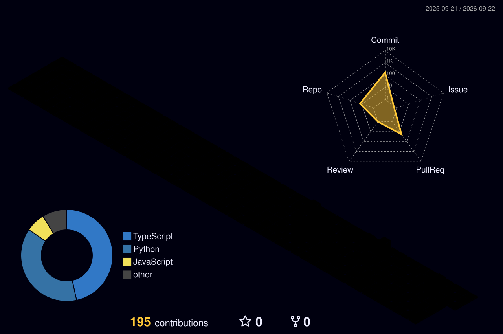

# 👋 Olá, eu sou Victor Maffei

### Full Stack Developer • Node.js • React Native • Cybersecurity

---

## 🧠 Sobre mim

Sou estudante de Análise e Desenvolvimento de Sistemas, focado em transformar problemas reais em produtos de software.

- 🚀 Desenvolvimento Web e Mobile
- ⚙️ Node.js, JavaScript e React Native
- 🗄️ APIs, bancos de dados e integrações
- 🔐 Interesse em Cibersegurança
- 🤖 Automação e aplicações com IA

---

## 🛠️ Stack

---

## 🚀 Projetos em destaque

| Projeto | Descrição |
|---|---|
| **LeadGuardianAI** | Plataforma para acompanhamento, distribuição e gestão inteligente de leads. |
| **Squ4ttro Motors App** | Aplicativo mobile para estoque e atendimento automotivo. |
| **K&C Store** | E-commerce moderno para moda masculina, feminina e infantil. |
| **ApetitFoodBot** | Bot de automação e controle para atendimento nutricional. |
| **NetHunter** | Scanner de portas TCP e detector de serviços. |

---

## 📊 GitHub Analytics

---

## 🧊 3D Contributions

---

## 📈 Atividade

---

## 📫 Contato

📧 **vmaffei.dev@gmail.com**  
💼 **LinkedIn:** [Victor Maffei](https://www.linkedin.com/in/victor-giuliano-coutinho-maffei-8102311a3/)

---

### "Construindo soluções reais com código."

